I have authored multiple articles for Scaler's "Scaler Topics" knowledge base.

The articles provided an introductory overview of different AWS services like EC2 Instances, AWS Lambda etc. (https://www.scaler.com/topics/aws/). I also created the accompanying visuals for each article.

The articles are:

[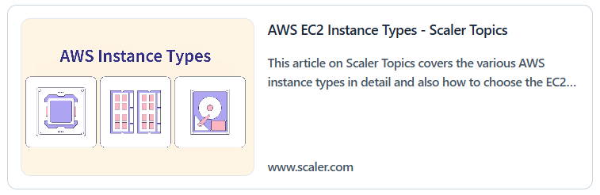](https://www.scaler.com/topics/aws/aws-instance-types)

[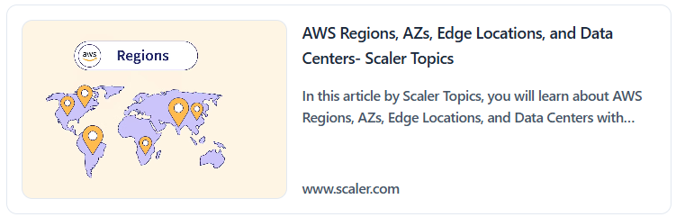](https://www.scaler.com/topics/aws/aws-regions/)

[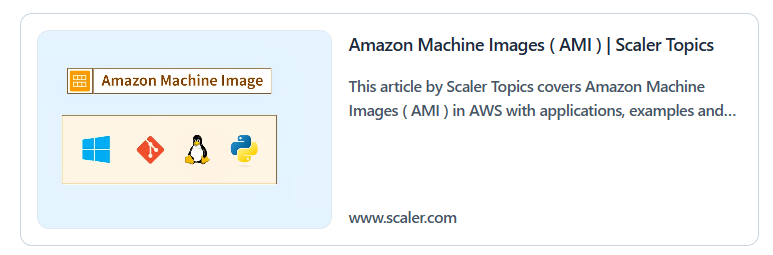](https://www.scaler.com/topics/aws/amazon-machine-image/)

[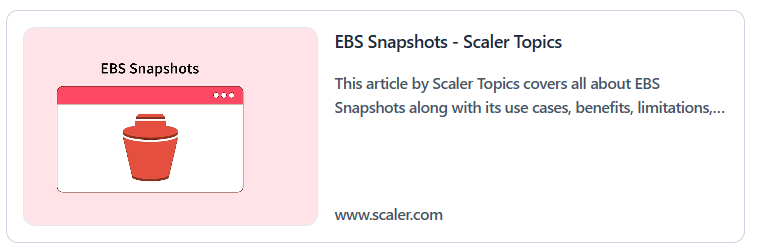](https://www.scaler.com/topics/aws/ebs-snapshots/)

[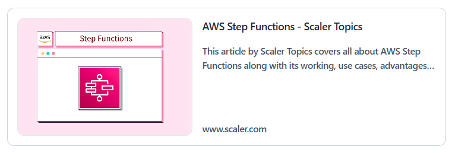](https://www.scaler.com/topics/aws/aws-step-functions/)

[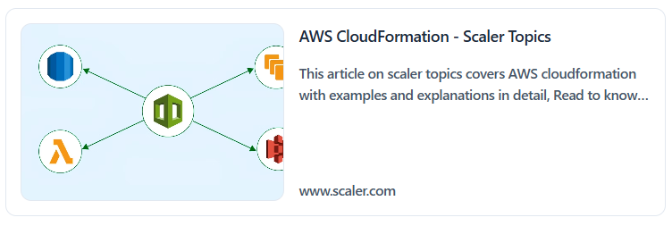](https://www.scaler.com/topics/aws/aws-cloudformation/)

[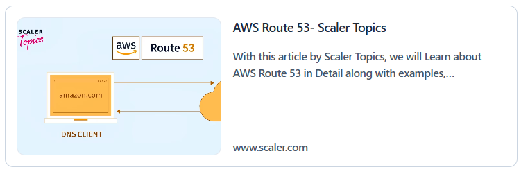](https://www.scaler.com/topics/aws/route-53/)

[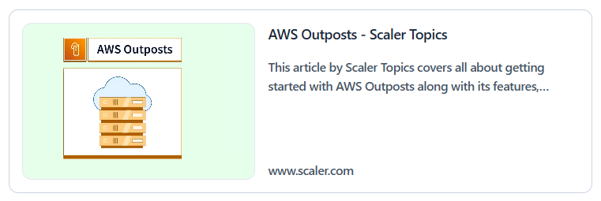](https://www.scaler.com/topics/aws/aws-outposts/)

[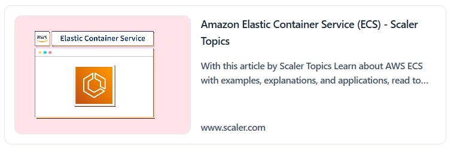](https://www.scaler.com/topics/aws/aws-ecs/)

[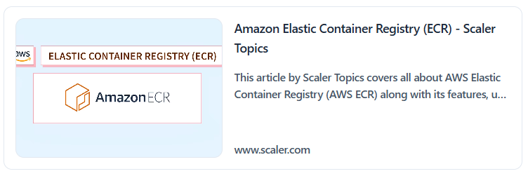](https://www.scaler.com/topics/aws/aws-ecr/)

[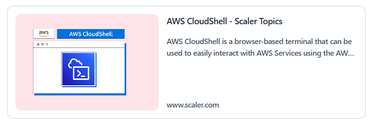](https://www.scaler.com/topics/aws/aws-cloudshell/)

[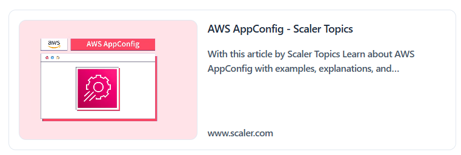](https://www.scaler.com/topics/aws/aws-appconfig/)

[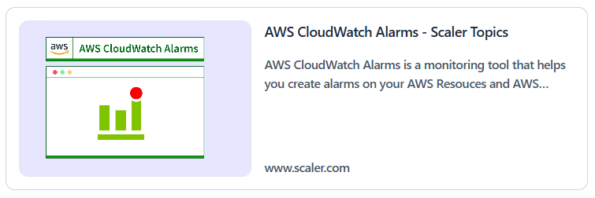](https://www.scaler.com/topics/aws/cloudwatch-alarms/)