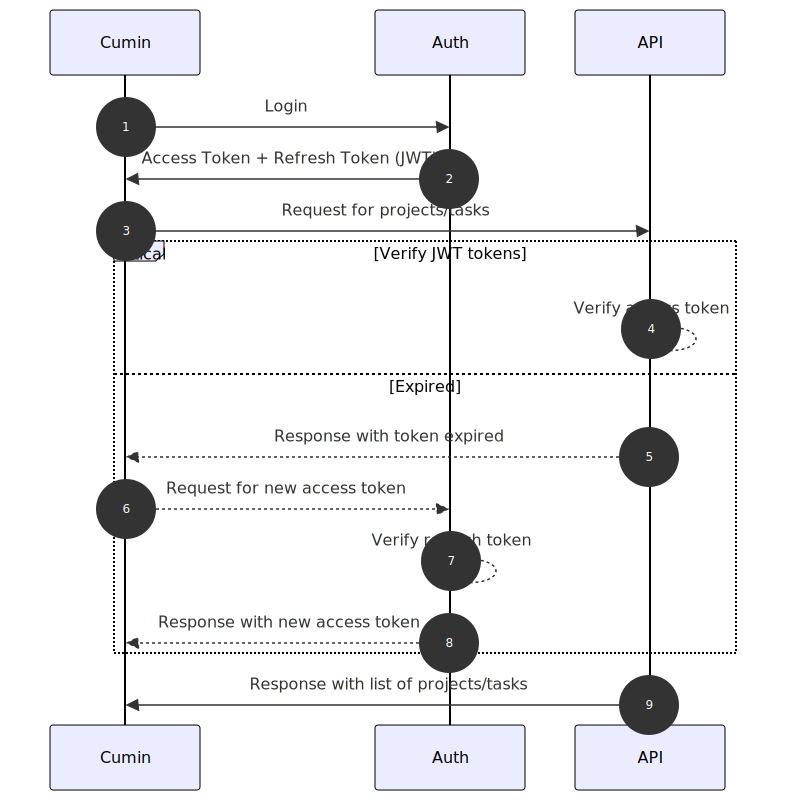
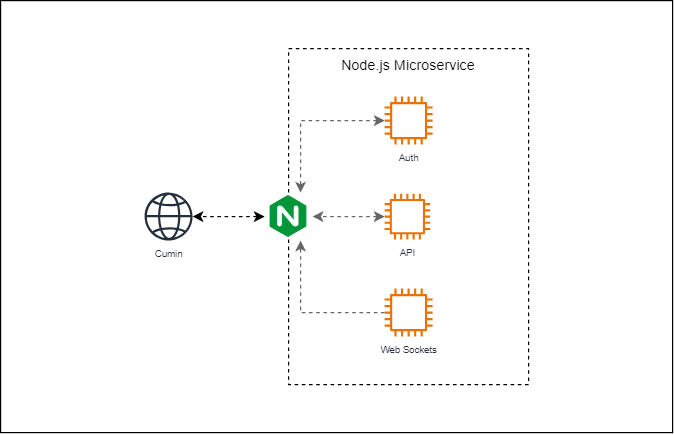
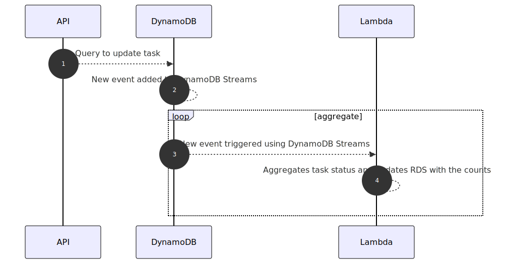
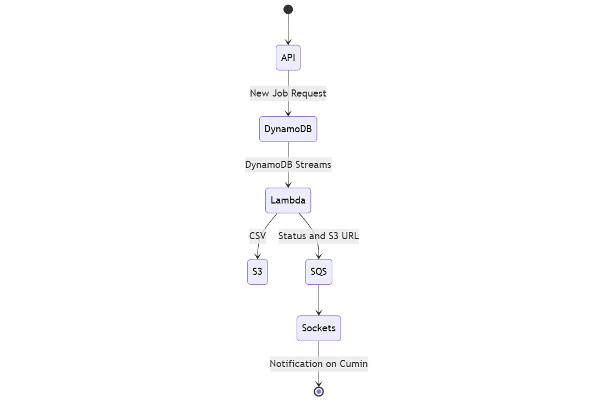

[Cumin](https://anikeshk.com/project/cumin/) is a **scalable and secure** task management tool designed by leveraging a modern **microservices architecture** with a focus on scalability, security, and real-time collaboration. In this post, we will take a look at five design patterns that Cumin uses.

## 1. JWT for Authentication

Cumin uses **JSON Web Tokens (JWT)** to handle authentication securely. When a user logs in, a signed JWT is issued, which is then included in subsequent requests for authorization. This stateless approach ensures scalability and reduces the need for frequent database lookups while maintaining secure access control.

The sequence diagram above illustrates the typical JWT authentication flow when the React client sends an API request.

The steps in the **critical** section demonstrate how the API service verifies the JWT access token and how the Auth service issues new tokens if the access token has expired. The React client uses **[Axios Interceptors](https://axios-http.com/docs/interceptors)** to detect expired tokens and request new tokens seamlessly.

## 2. Nginx as a Reverse Proxy 

A **reverse proxy** is a server that sits between client devices and backend servers, forwarding client requests to the appropriate backend service and returning the response to the client. It acts as an intermediary, improving performance, security, and load balancing.

Cumin uses **Nginx** as a reverse proxy between the React client and the Node.js microservices. In the current version, Nginx is primarily used for routing requests to the appropriate microservice. This enables the React client to interact with a **single API URL** instead of managing separate URLs for each service. In the future, Nginx could also handle SSL termination and serve as an intermediary for authentication verification requests, further improving security and performance.

## 3. Amazon DynamoDB Streams for Event-Driven Architecture

To enable event-driven architecture, Cumin leverages **Amazon DynamoDB Streams**. Whenever data changes in DynamoDB, events are captured and processed by **AWS Lambda** functions, facilitating workflows such as data aggregation and asynchronous background jobs.

The sequence diagram above illustrates one of the few ways Cumin takes advantage of DynamoDB Streams. When a task's status changes, the count for each status category *(To Do, In Progress, Done)* need to be updated for display on the the Projects page. Instead of executing a costly "group by" or aggregation query each time the task status changes, the AWS Lambda function compares the `OLD_IMAGE` with the `NEW_IMAGE` and updates only the affected statues. This optimization reduces database load, making it especially efficient when handling millions of tasks.

Learn more about DynamoDB Stream design patterns here: https://aws.amazon.com/blogs/database/dynamodb-streams-use-cases-and-design-patterns/

## 4. Amazon SQS as a Message Queue

Cumin uses **Amazon Simple Queue Service (SQS)** to decouple microservices, ensuring that tasks are processed asynchronously without direct dependencies. This improves system resilience by allowing services to communicate efficiently, handle spikes in traffic, and retry failed operations without impacting overall performance.

The state diagram above illustrates how the Lambda function processes an export job and sends a message to an Amazon SQS queue. The sockets server then polls the SQS queue, processes the message, and sends a notification to the React client.

At no point is the client waiting for the export job to complete - Amazon SQS enables **asynchronous processing**, allowing the job to run in the background. Once the job is finished, the client receives a notification, ensuring a seamless user experience without blocking UI interactions.

## 5. Web Sockets for Real-Time Notifications

For instant updates and seamless user experiences, Cumin implements **Web Sockets**. This enables bidirectional communication between clients and servers, allowing real-time notifications for events such as task updates, project changes, or team activities.

*Image from [socket.io/docs/v4/server-socket-instance](https://socket.io/docs/v4/server-socket-instance/)*

Cumin uses **[sockets.io](https://socket.io/)** to manage the Web Socket connections. Currently, the notifications are limited to updates on the export jobs. However, support for additional notifications like the ones mentioned above will be added soon.

---

Read more about Cumin here: [anikeshk.com/project/cumin/](https://anikeshk.com/project/cumin/)

Check out the code here: [github.com/anikeshk/cumin](https://github.com/anikeshk/cumin)