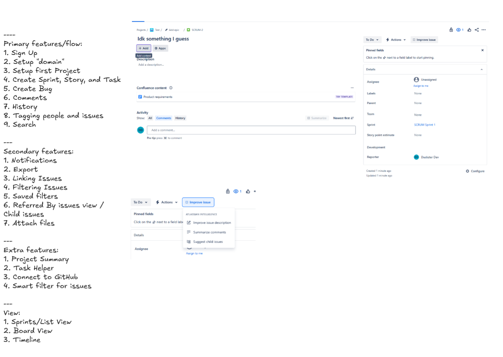

> These are raw, unedited thoughts as I was working on this project. The grammar and spelling might not neccesarily be correct.

### Day 0: ???, 2024

- I think a clone of Jira would be a feature rich project, with appropriate complexity.
- [Stumble](https://anikeshk.com/project/stumble/) is a more of "depth" project which demostrates skills like going deep into user research, interface design, and rapid iteration. It also showed how I can quicky grasp technologies that I have little experience in (Android and Firebase), and integrate these well.
- I think this project should be more of a "breadth" project, where I can showcase my broader system design skills, how I make decisions/compromises and demo multiple technologies/languages that I already have vast experience in.

\-

- **How do you start a new project?** ~~By buying a new domain!~~ By naming the project!
- What's a good name for a clone of Jira? 
  - Jeera...? (the word in Hindi of the spice which is a homophone to Jira)
  - Cumin...? (the English name of the word in Hindi of the spice which is a homophone to Jira)

---

### Day 1: 15th Jan, 2025

- To refresh my memory on the interface/features and understand how the "fresh user experience" is, I setup a new Jira account and played out for a bit. I listed down some of the potential features below:

- **Decision #1**
  - *What*: Multiple GitHub repos vs Monorepo with single GitHub repo
  - *Why*: Dictates how I showcase this project, and how I use CICD
  - I think I am going to try to use a monorepo as it is easier to *present* the project when all of it in one place, rather than when it split among different repositories.
  - From the complexity of this project, I think I am going to stick to npm/pnpm rather than trying to muck around with nx or turborepo.
  - It should be relatively easy to manage with npm workspaces (if required), and GitHub Actions supports workflows based on directory path.
  - *Decision*: Monorepo
