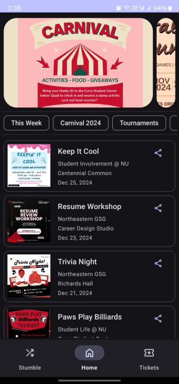
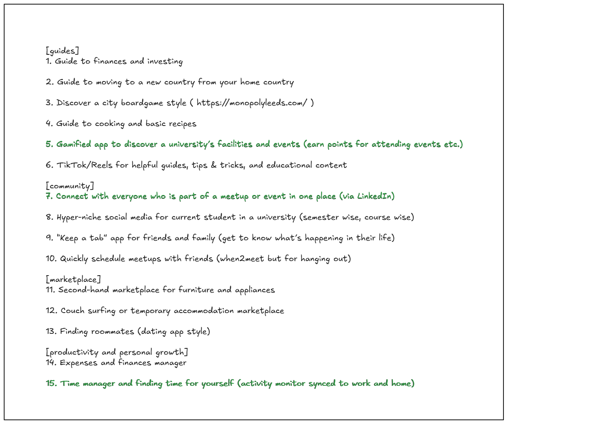
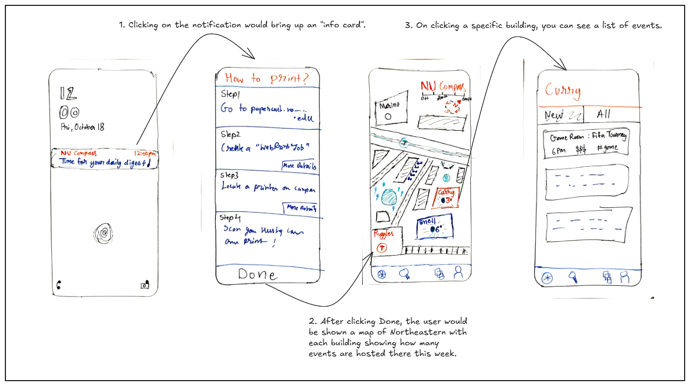
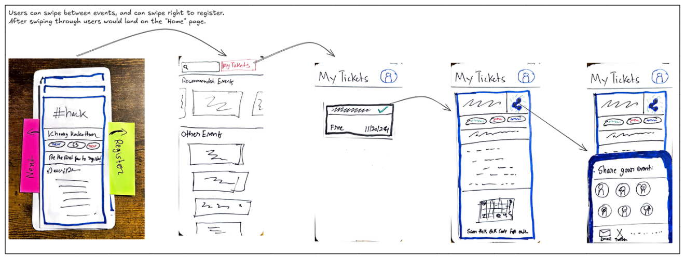

Stumble is an Android app designed for event discovery and ticket booking, tailored specifically for Northeastern University students. This project was developed as part of my coursework in Fall 2024, integrating concepts from two courses:

- **CS 5430 (Computer/Human Interaction)**: Focused on user experience design, I applied techniques such as paper prototyping and tools like Figma for UI design. I incorporated Material Design principles for enhanced usability.
- **CS 5520 (Mobile App Development)**: This course deepened my understanding of modern Android development, where I worked extensively with Firebase and explored the evolving Android technology landscape.

In the following sections, I’ll walk through the journey of transforming the idea behind Stumble into a fully functional app.

### Ideation

The idea for Stumble initially came from an 'Ideation' assignment in the CS 5430 course. I was tasked with generating 15 ideas around this semester's course theme - “adulting”. After a quick feedback session with a peer, I narrowed it down to the three most promising ideas. Here are the ideas I came up with:

The ideas highlighted in green were selected as the most promising. These were intended to help shape my final project concept.

### Paper Prototyping

The next assignment involved building low-fidelity prototypes and conducting paper prototyping with several test users. In the sections below, I have included images that illustrate the evolution of the paper prototype through various iterations.

**Iteration #1: NU Compass (paper prototype)**

In the first iteration, the app was called “NU Compass” and revolved around a map of Northeastern University. The app also had other components like “flash cards” which would provide tips and tricks about the university - apart from event discovery.

**Iteration #2: Stumble (paper prototype)**

In the second iteration, the app was re-named to “Stumble”, the focus was streamlined into only event discovery and ticket booking. Although this meant losing features like the “flash cards”, the overall app experience became more cohesive.

### High Fidelity Prototype

The high fidelity prototype was created in Figma:

<iframe style="border: 1px solid rgba(0, 0, 0, 0.1);" width="800" height="450" src="https://embed.figma.com/design/UfSDk6jFKa1o7L6q6FOrNw/Stumble-Design-v1?node-id=1-2&embed-host=share" allowfullscreen></iframe>

This design was used as reference to develop the Android app. I used the [Material Theme Builder](https://material-foundation.github.io/material-theme-builder/) to finalize the color scheme for the app.

### Development

I developed the app in Android Studio. I used Firebase Authentication for user login and management. Firebase Firestore was used to store all the event data.

The code for the project is available here 👉

The complete slides for my class presentation are available below.

<iframe src="https://docs.google.com/presentation/d/e/2PACX-1vTXbB_XgwpsRmA1ZJ5SArx0hxFBbUg205SADYLGItKgmF6oVAoSIXz_RanlTIMomUYxGHkDEcjjbZBD/embed?start=false&loop=false&delayms=3000" frameborder="0" width="960" height="569" allowfullscreen="true" mozallowfullscreen="true" webkitallowfullscreen="true"></iframe>
